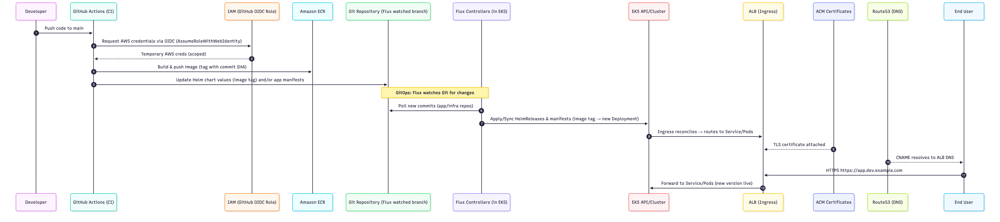
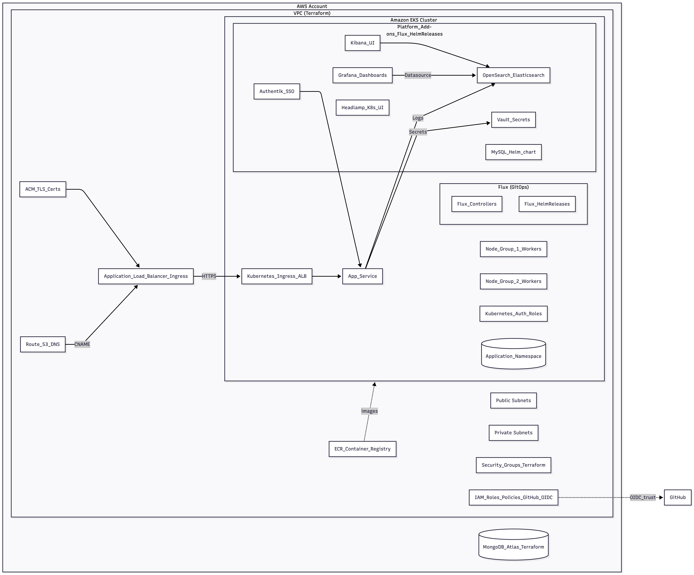
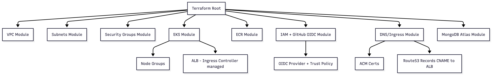
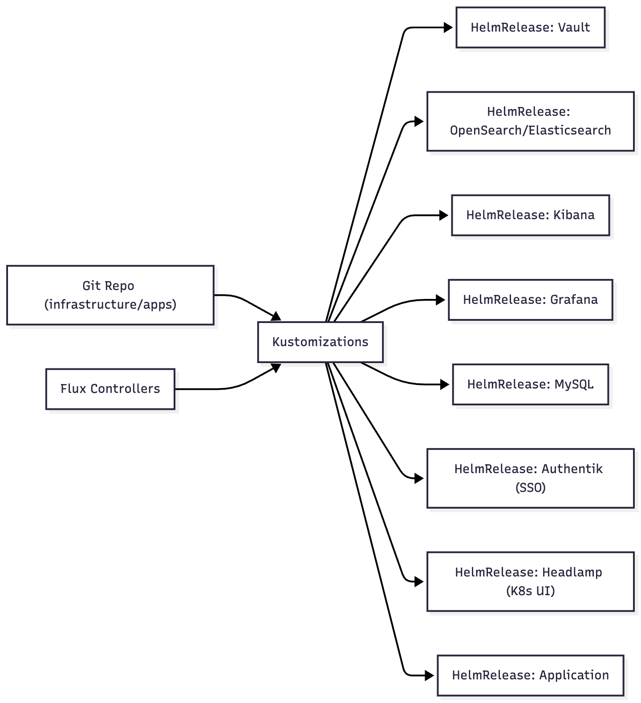
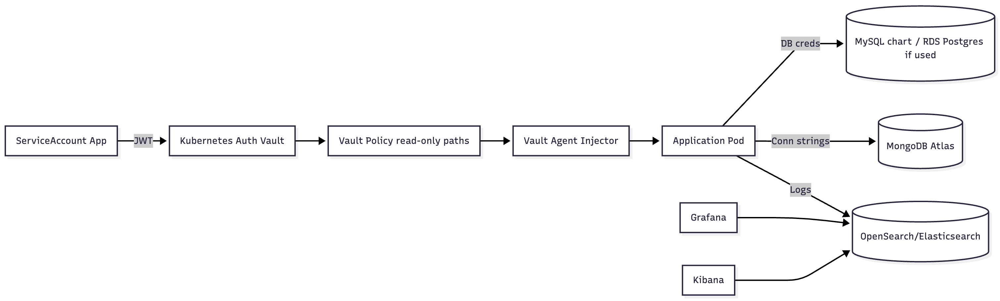

# BKT Platform

## Overview

BKT Platform is a minimum GitOps setup that shows how we manage infrastructure with Terraform and continuously deliver platform services and applications to Amazon EKS with Flux. Push your code to GitHub, let GitHub Actions build and push images to Amazon ECR, and rely on Flux to keep the cluster in sync. The result is an HTTPS endpoint fronted by AWS Load Balancer Controller, Route 53, and ACM.

## Vision

Create a self-service developer platform on AWS where infrastructure is defined once, delivery is automated end to end, and secrets, observability, and access are first-class citizens. Everything needed to run an app in the dev environment lives in Git and is reconciled by Flux.

## Core Workflow

1. Push code and Helm changes to GitHub.
2. GitHub Actions runs tests, builds the image, and pushes to ECR.
3. Flux notices the change, updates HelmReleases, and applies manifests to EKS.
4. AWS Load Balancer Controller exposes the app through ACM-backed TLS and Route 53 DNS.
5. Pods pull secrets from Vault, while logs and metrics land in OpenSearch and Grafana.

## Platform Footprint

- **Infrastructure:** Terraform modules covering VPC, networking, IAM with GitHub OIDC, EKS control plane and node groups, ECR, MongoDB Atlas, Route 53, and ACM.
- **Platform services:** Flux-managed Helm releases for Vault (with Agent Injector), Authentik, Headlamp, MySQL, OpenSearch/Elasticsearch with Kibana, Grafana, and optional Fluent Bit.
- **Applications:** Sample Helm chart including Deployment, Service, Ingress, ConfigMap, and Vault-powered secrets handling.

## Tech Stack

- **AWS EKS:** Managed Kubernetes control plane and worker nodes that host platform workloads.
- **Terraform:** Infrastructure-as-code tool that provisions AWS resources and third-party integrations.
- **FluxCD:** GitOps controller that syncs Kubernetes manifests and Helm releases from Git.
- **Helm:** Package manager used to template and install platform and application charts.
- **HashiCorp Vault:** Central secrets store with Kubernetes auth and Agent Injector for secure secret delivery.
- **OpenSearch/Elasticsearch:** Log storage and search engine powering the logging pipeline.
- **Kibana:** UI for exploring logs indexed in OpenSearch/Elasticsearch.
- **Grafana:** Dashboard layer for visualizing metrics and logs via Elasticsearch datasource.
- **MongoDB Atlas:** Managed document database provisioned via Terraform for application persistence.
- **MySQL:** Relational database deployed with a Helm chart for services that need SQL storage.
- **GitHub Actions:** CI pipeline that builds, tests, and publishes container images plus manifest updates.
- **Amazon ECR:** Private container registry that stores application images built in CI.
- **Authentik:** Identity provider offering SSO for platform access.
- **Headlamp:** Web UI for Kubernetes cluster inspection and developer workflows.

## Architecture Highlights

- Terraform owns the AWS foundation and integrates third-party services such as MongoDB Atlas.
- Flux bootstraps itself, watches Git, and keeps the cluster aligned with desired state.
- Vault Agent Injector wires Kubernetes auth to secrets delivery without baking secrets into images.
- Observability combines OpenSearch/Elasticsearch, Kibana, and Grafana for a single-node, dev-friendly setup.
- Authentik and Headlamp simplify secure cluster access for developers.

## Visual Guides

**End-to-End Workflow**

**High-Level Architecture**

**Terraform Topology**

**Flux GitOps Layout**

**Vault Secrets Flow**

## Scope

- **In scope:** Terraform modules for core AWS services, Flux bootstrap and GitOps layout, platform add-ons (Vault, observability stack, SSO, DBs), sample application Helm chart, GitHub Actions pipeline to build/push images.
- **Out of scope:** Multi-cloud portability, advanced deployment strategies (blue/green, canary), strict compliance regimes, production-grade high availability, detailed cost management.

## Prerequisites

- AWS account with permissions for EKS, VPC, ACM, Route 53, IAM, and ECR.
- Terraform CLI
- Helm CLI
- Configured GitHub Actions runner (OIDC to AWS and ECR access)

## Getting Started

1. Review the docs in `docs/` for project goals, architecture, and workflow.
2. Apply the Terraform modules (under `infrastructure/`) to provision network, IAM, EKS, and optional MongoDB Atlas resources.
3. Bootstrap Flux in the cluster so it reconciles the platform and application charts.
4. Modify the sample application chart, commit, and push. Flux will deploy the change automatically.

## Reference Docs

- [Project Definition](docs/Project-Definition.md)
- [Architecture Overview](docs/Architecture-Overview.md)
- [Development Workflow](docs/Development-Workflow.md)
- [Team](docs/Team.md)
- [Verified Commits Guide](docs/Verified-Commits-Guide.md)
- [Wiki Home](docs/Wiki-Home.md)

## Contributing

See [CONTRIBUTING](.github/CONTRIBUTING.md) for coding standards, commit guidance, and required checks.

## License

MIT © Bilgisayar Kavramlari Toplulugu. See [LICENSE](LICENSE).

